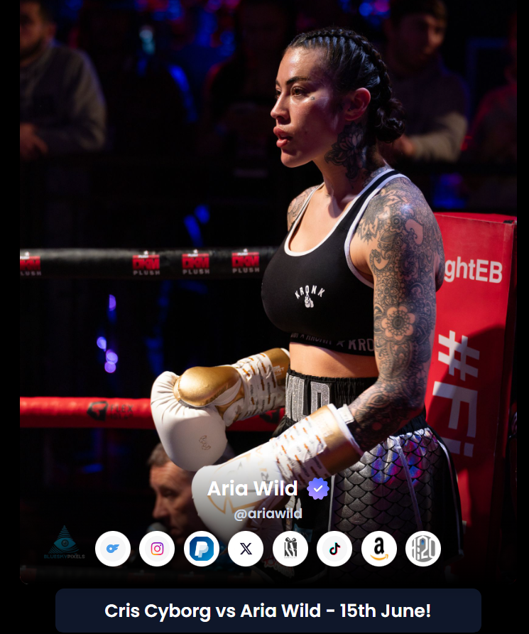

## Aria Wild

Introducing Aria Wild Front End Website 2.0, a sleek and refined iteration with several enhancements aimed at elevating user experience and visual appeal.

### **2.0 Major Changes and Features:**

- Style Changes: We've revamped the aesthetic of the website with a fresh new look, incorporating modern design elements to captivate and engage visitors.

- Poppins Bold Font: Say hello to enhanced readability and a touch of sophistication with the addition of Poppins Bold font, striking a perfect balance between elegance and clarity.

- Animation: Prepare to be mesmerized as subtle yet dynamic animations breathe life into the interface, offering a delightful browsing experience that seamlessly guides users through the content.

- Footer:We respect intellectual property rights, which is why our footer includes a copyright notice to protect our content and ensure proper attribution.

- Header Shadow Enhancement: We've fine-tuned the header to perfection, ensuring a seamless transition from solid opacity at the bottom to a gradual decrease upwards, creating a visually pleasing effect that enhances depth and dimension.

- Browser Title Bar Icon: Never lose sight of Aria Wild with our newly added browser title bar icon, making it easier than ever for users to identify and return to your website amidst a sea of tabs.

- Preloader: Say goodbye to waiting frustration as our sleek preloader keeps users engaged while content loads in the background, ensuring a smooth and uninterrupted journey through the website.

Aria Wild Front End Website 2.0 is not just an upgrade—it's a testament to our commitment to innovation and excellence, delivering an immersive web experience that leaves a lasting impression. Welcome to the next level of online presence.

## Resources & Credits

- Tailwind Library
- Gsap
- Poppins Font

## Live Link

Hosted in Netlify -> https://665ce63e1ce667b3012f8ad8--luxury-youtiao-bbecf6.netlify.app/
